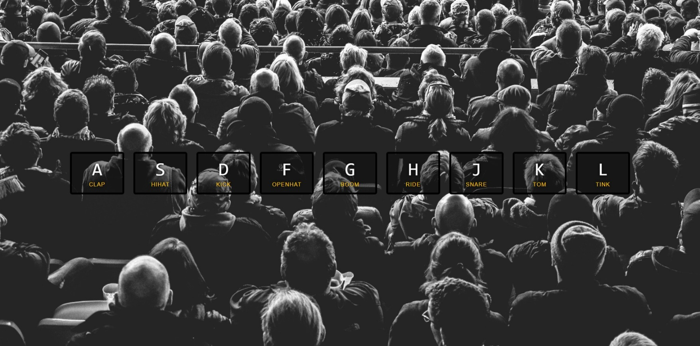

# 30 Days JavaScript Challenge - DrumKit

This is a solution to the [30 Days JavaScript Challenge - Challenge 1](https://courses.wesbos.com/account/access/65e08bd4a3eaa1a25e70b560/view/194130650). A series of challenges using vanilla javascript which improves your skills without using any frameworks aur complex libraries.

## Table of contents

- [Overview](#overview)
  - [The challenge](#the-challenge)
  - [Screenshot](#screenshot)
  - [Links](#links)
- [My process](#my-process)
  - [Built with](#built-with)
  - [What I learned](#what-i-learned)
- [Author](#author)

## Overview

### The challenge

The project entails conceptualizing the design, procuring materials, constructing or programming the kit, testing its functionality, and potentially refining or customizing it based on feedback. The end goal is to create a functional and enjoyable drumming experience, whether for personal use, performance, or educational purposes.

### Screenshot



### Links

- Solution URL: https://github.com/NamanG22/DrumKit
- Live Site URL: https://namang22.github.io/DrumKit/

## My process

### Built with

- Semantic HTML5 markup
- CSS custom properties
- Flexbox
- CSS Grid
- Media Queries
- Mobile-first workflow
- Vanilla Javascript

### What I learned

The problem I found was the consecutive clicks of a particular button does not repeat the sound track with the same frequency as the clicks.

```js
audio.currentTime=0;
audio.play();
```
This solved the problem.

## Author

- GitHub - [@NamanG22](https://github.com/NamanG22)
